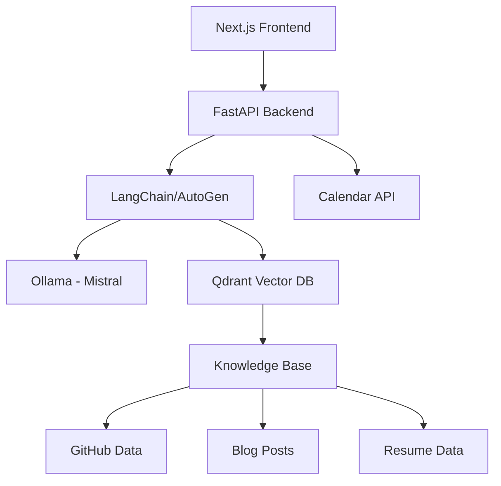

# AI-Powered Portfolio

A modern, open-source portfolio website with an integrated AI agent that can interact with visitors, showcase projects, and manage scheduling. Built with the latest open-source AI technologies and modern web development practices.

## 🌟 Features

- **Conversational Interface**: Natural language interaction with visitors
- **Knowledge Integration**: 
  - GitHub projects and contributions
  - Blog posts and technical writing
  - Resume and professional experience
- **Intelligent Responses**: RAG-powered responses using your personal knowledge base
- **Calendar Integration**: Smart scheduling and availability management
- **Session Awareness**: Contextual conversations with memory
- **Modern UI**: Responsive, accessible, and beautiful design
- **100% Open Source**: All components are free and open source

## 🏗 Architecture



## 🛠 Tech Stack

### Frontend
- **Framework**: Next.js 14 with App Router
- **Language**: TypeScript
- **Styling**: Tailwind CSS
- **Components**: shadcn/ui
- **State Management**: Zustand
- **Testing**: Jest + React Testing Library

### Backend
- **Framework**: FastAPI
- **AI Orchestration**: LangChain + AutoGen
- **LLM**: Mistral (via Ollama)
- **Vector Store**: Qdrant
- **Testing**: pytest

### Infrastructure
- **Containerization**: Docker + Docker Compose
- **IaC**: Terraform
- **CI/CD**: GitHub Actions
- **Monitoring**: Grafana + Prometheus

## 🚀 Getting Started

### Prerequisites
```bash
# Required tools
- Docker & Docker Compose
- Node.js 18+
- Python 3.11+
- Git
```

### Local Development
1. Clone the repository
```bash
git clone https://github.com/yourusername/ai-portfolio.git
cd ai-portfolio
```

2. Start the development environment
```bash
docker-compose up -d
```

3. Access the services:
- Frontend: http://localhost:3000
- API Docs: http://localhost:8000/docs
- Qdrant UI: http://localhost:6333/dashboard

### Environment Setup
Create a `.env` file in the root directory:
```env
NODE_ENV=development
OLLAMA_MODEL=mistral
QDRANT_COLLECTION=portfolio_knowledge
```

## 📝 Documentation

- [Architecture Overview](./docs/architecture.md)
- [AI Agent Design](./docs/ai-agent.md)
- [RAG Implementation](./docs/rag.md)
- [API Documentation](./docs/api.md)
- [Deployment Guide](./docs/deployment.md)

## 🌐 Deployment

### Cost-Effective Production Setup
- **Frontend**: Vercel (Free tier)
- **Backend**: Railway.app/Fly.io (Free tier available)
- **Vector Store**: Qdrant Cloud (Free tier - 1GB, 1M monthly requests)
- **LLM**: Self-hosted Ollama
- **Monitoring**: Grafana Cloud (Free tier)

### Self-Hosted Option
Detailed instructions in [deployment guide](./docs/deployment.md)

## 📄 License

This project is licensed under the MIT License.

## 🙏 Acknowledgments

- [Mistral AI](https://mistral.ai/) for the open-source LLM
- [Qdrant](https://qdrant.tech/) for the vector database
- [LangChain](https://langchain.org/) for the AI framework
- [Ollama](https://ollama.ai/) for the LLM serving solution
- [shadcn/ui](https://ui.shadcn.com/) for the beautiful components 